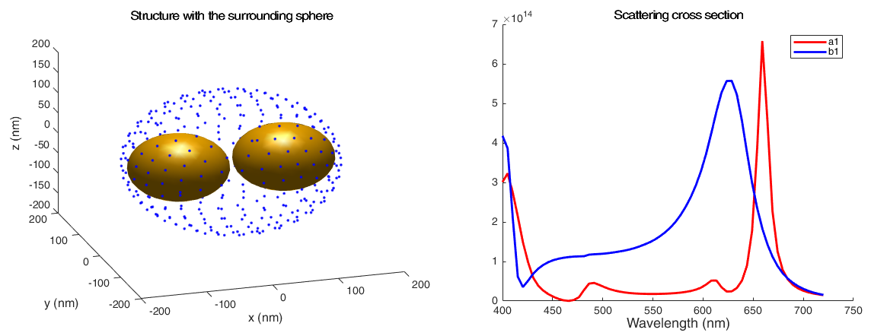

# Multipole analysis of nanostructures
Mini-toolbox for multipole analysis of nanostructures implemented in MATLAB &reg;.

 

## General info
Project created for the purpose of a master thesis. The goal is to create tools which allow performing analysis of electromagnetic field scattered over the nanostructures. In particular to find the electric and magnetic dipole moments.

## Technologies
* Matlab R2017a
* MNPBEM, Matlab Toolbox

## Status
The results are approximate and not fully tested.

## Setup
The MNPBEM toolbox can be downloaded from [here](http://physik.uni-graz.at/mnpbem/). One must be familiar with this toolbox to perform analysis. 

## Code example
Code examples available in the directory *examples*.

## Sources
[1] Stefan Mühlig, Christoph Menzel, Carsten Rockstuhl, Falk Lederer, *Multipole analysis of meta-atoms*, Metamaterials, Volume 5, Issues 2–3, 2011.

[2] Function *getLebedevSphere.m*, Copyright (c) 2010, Robert Parrish, All rights reserved.